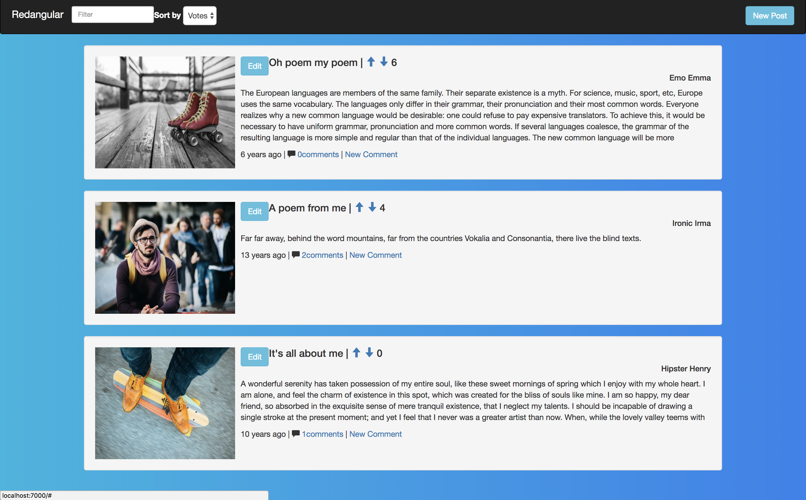
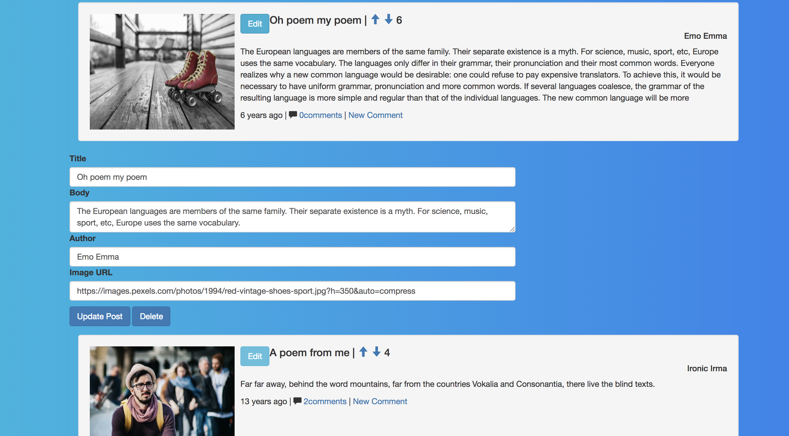
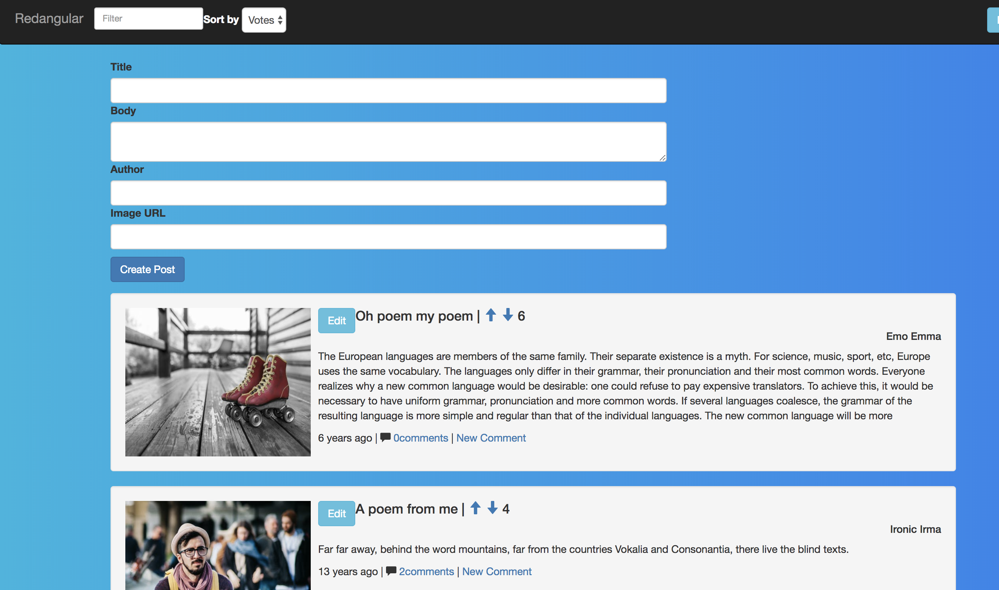

# reddit-clone
A full stack CRUD application created with Angular, Express and Knex.

Users can create, edit, and delete posts along with adding comments, filter posts (by votes, title, author) and vote for posts they like and dislike.

